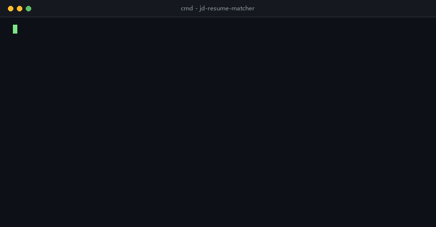

# jd-resume-matcher



JD↔简历结构化匹配与解释器：纯离线规则抽取 + 多因素加权打分，**每条推荐理由都能回溯到 JD/简历原文的证据片段**。

> 设计动机：招聘筛选不该是黑盒打分。本项目把"为什么推荐/为什么不推荐"拆成逐因素、带证据的解释链路，与可解释推荐（如 smart_tutor 的学习路径推荐）同一思路：先结构化、再建模、最后解释。

## 功能特性

- **输入**：职位描述 + 简历文本（Markdown / 纯文本均可），或一份 JD 对目录下多份简历
- **解析**：规则 + 关键词抽取技能（47 规范名，含别名归一；词表外置 `matcher/data/vocab.json`，支持 `--vocab` 叠加自定义条目）、学历阶梯、工作年限、领域标签，**不依赖 LLM，离线可跑、结果确定**
- **打分**：六因素加权 `total_score` + `score_breakdown` + 逐条 `reasons`，权重集中在 `matcher/constants.py` 并逐条注明设计依据
- **批量模式**：`--resume-dir` 一份 JD 筛整个简历文件夹，按总分降序输出候选名单；单份文件损坏/为空只记失败不中断整批，`--min-score` 做"无人达标即失败"的流水线闸门，`--csv` 导出 utf-8-sig 候选名单（Excel 友好）
- **交互 Demo**：`streamlit run streamlit_app.py` 单文件双页签（单份匹配 + 批量筛选），示例数据预填、打开即出完整结果，展示层之外的纯函数可独立测试
- **语义路**：嵌入 provider 可插拔 —— `mock`（确定性字符 3-gram 哈希，默认）与 `openai_compatible`（可选）；无 API Key / URL 非法 / 调用失败时**三级优雅降级**到纯规则
- **交付**：FastAPI `/match` 端点 + CLI 演示命令 + Streamlit 交互 Demo + 117 个 pytest 全绿 + ruff 静态检查门禁

## 架构

```mermaid
flowchart LR
    A[JD 文本] --> P[规则解析器<br/>taxonomy + 正则]
    B[简历文本] --> P
    P --> J[ParsedProfile JD]
    P --> R[ParsedProfile 简历]
    J --> S[加权打分器<br/>constants 权重]
    R --> S
    E[嵌入 Provider<br/>mock / openai_compatible] -.语义因素 0.05.-> S
    E -.缺 Key/失败自动降级.-> S
    S --> O[MatchResult<br/>total_score + breakdown<br/>reasons × 证据片段]
    O --> API[FastAPI /match]
    O --> CLI[cli.py 演示报告]
```

## 快速开始

```bash
# 1. 安装（Python 3.10+）
pip install -r requirements.txt

# 2. 交互 Demo（Streamlit，浏览器打开后示例已预填，开页即见完整匹配结果）
streamlit run streamlit_app.py

# 3. CLI 演示：内置示例，零参数可跑
python cli.py --demo

# 4. CLI：指定 JD 与简历文件
python cli.py examples/jd_backend.md examples/resume_strong.md

# 5. 批量模式：一份 JD 对目录下全部简历（.md/.txt），按总分降序输出候选名单
python cli.py examples/jd_backend.md --resume-dir examples/batch_resumes

# 6. 批量结果导出 CSV（utf-8-sig，Excel 双击打开中文不乱码）
python cli.py examples/jd_backend.md --resume-dir examples/batch_resumes --csv ranked.csv

# 7. 启动 API
uvicorn matcher.main:app --port 8000
```

调用 `/match`：

```bash
curl -X POST http://127.0.0.1:8000/match -H "Content-Type: application/json" -d @- <<'EOF'
{
  "jd_text": "任职要求：本科及以上学历，3年 Python 经验，熟练 FastAPI、MySQL。",
  "resume_text": "计算机专业硕士，5年 Python 经验，熟练 FastAPI 与 MySQL。"
}
EOF
```

响应核心字段：`total_score`（0-100）、`grade`/`grade_label`（A 强烈推荐 / B 推荐 / C 待定 / D 不匹配）、`score_breakdown`（逐因素：基础权重、生效权重、得分、理由）、每条 `reason` 附 `evidence[]`（原文片段 + 字符偏移 + 来自 JD/简历）。

可选命令行参数：`--no-semantic`（纯规则）、`--json`、`--min-score N`（低于阈值退出码 1，可做流水线闸门；批量模式语义为"无人达标退出码 1"）、`--resume-dir 目录`（批量模式，需同时给 JD 文件）、`--vocab 词表.json`（叠加自定义技能词表，见下节）、`--provider openai_compatible --base-url ... --model ...`。

批量模式输出示例（真实运行）：

```
================================================================
批量匹配报告    JD: examples/jd_backend.md    共 3 份（成功 3 / 失败 0）
================================================================
  1. chen_ming.md     84.6  B 推荐    缺口: RESTful API
  2. lin_xiaoyu.md     48.5  D 不匹配    缺口: Docker、FastAPI、RESTful API、Redis
  3. wang_dalisheng.md     29.7  D 不匹配    缺口: Docker、FastAPI、Python、RESTful API、Redis、SQL、大数据
================================================================
```

失败条目（如空文件、超过 5 万字符上限）列在名单末尾并附原因，`--json` 时以 `error` 字段给出，`total/matched/failed` 计数齐全。

批量模式加 `--csv 路径` 可把候选名单导出为 CSV（utf-8-sig 带 BOM，Excel 直接打开不乱码），列为扁平汇总：`rank, resume_path, total_score, grade, grade_label, missing_required_skills, semantic_enabled, provider, error`，真实运行示例（`examples/jd_backend.md --resume-dir examples/batch_resumes --csv`）：

```
rank,resume_path,total_score,grade,grade_label,missing_required_skills,semantic_enabled,provider,error
1,chen_ming.md,84.6,B,推荐,RESTful API,1,mock,
2,lin_xiaoyu.md,48.5,D,不匹配,Docker、FastAPI、RESTful API、Redis,1,mock,
3,wang_dalisheng.md,29.7,D,不匹配,Docker、FastAPI、Python、RESTful API、Redis、SQL、大数据,1,mock,
```

## 交互 Demo

单文件 `streamlit_app.py`，两个页签，examples/ 示例数据预填，打开页面即呈现完整结果：

- **单份匹配**：左右文本框贴 JD 与简历 → 总分与等级（A 强烈推荐 / B 推荐 / C 待定 / D 不匹配）大字展示 + 逐因素贡献水平条形图（贡献 = 生效权重 × 因素得分，合计即总分，禁用因素显式画 0）+ 打分理由列表（每条标注所属因素与权重贡献，命中理由附 JD/简历原文证据片段及字符偏移）；
- **批量筛选**：上传多份 `.md`/`.txt` 简历对比一份 JD（不上传则自动使用 `examples/batch_resumes/` 三份示例）→ 按总分降序的候选名单（含等级与硬性技能缺口列）+ CSV 下载（复用 `matcher/export.py`，utf-8-sig，Excel 友好）。

代码组织上，"读输入 → 调核心 → 组装展示数据"全部是与 `st.*` 无关的纯函数（`run_single_match` / `run_batch_match` / `weighted_contributions` / `reason_rows` / `batch_rows` / `csv_bytes`），Streamlit 只做渲染薄壳；批量页与 CLI 共用同一条 `matcher/batch.py` 管线，纯函数层由 `tests/test_streamlit_app.py` 直接覆盖。

### 本地运行

```bash
streamlit run streamlit_app.py
```

默认走 mock 嵌入 provider，离线确定性，无需任何 API Key。

### 部署到 Streamlit Community Cloud（免费）

1. 确保仓库在 GitHub 上可访问（本仓库即公开仓库 `lii-lii321/jd-resume-matcher`，fork 到自己账号亦可）；
2. 打开 [share.streamlit.io](https://share.streamlit.io)，用 GitHub 账号登录；
3. 点 **Create app** → **Deploy a public app from GitHub**；
4. Repository 填 `lii-lii321/jd-resume-matcher`，Branch 填 `master`（本仓库默认分支），Main file path 填 `streamlit_app.py`；
5. App URL 自定义后点 **Deploy**，等待依赖安装完成即得公网可访问的 Demo。

无需配置任何环境变量或密钥即可运行（mock provider 离线可用）；若要换 `openai_compatible`，需在 Cloud 的 App 设置里自行配置 `EMBEDDING_API_KEY`，不建议在公开 Demo 中放置真实密钥。

## 评分设计

权重集中在 `matcher/constants.py`（单一事实来源），设计依据写在常量注释里：

| 因素 | 基础权重 | 设计依据 |
|---|---|---|
| required_skills | 0.40 | 技能是"能不能干活"最直接信号 |
| preferred_skills | 0.10 | 加分项只做平滑，不当硬门槛 |
| experience | 0.20 | 与产出相关但简历自述易注水，低于技能 |
| education | 0.15 | 常见硬门槛但对实际产出区分度有限 |
| domain | 0.10 | 同领域经验降上手成本，属加分 |
| semantic | 0.05 | 规则漏召回的兜底信号，噪声大只给小权重 |

两个关键机制：

- **权重重分配**：JD 没写学历/领域/加分项时，对应因素禁用，其权重按比例摊回其余因素 —— 不同 JD 的总分始终 0-100 且可比；
- **证据回溯**：所有命中先在原文定位（`start`/`end` 字符偏移），理由引用证据而非凭空生成，测试强制校验 `source_text[start:end] == evidence.text`。

语义因素的可选 provider：

```bash
# mock（默认，确定性、离线）
python cli.py --demo

# openai 兼容端点（API Key 只从环境变量读取，仓库零密钥）
set EMBEDDING_API_KEY=<你的key>          # 占位符，切勿提交真实密钥
python cli.py --demo --provider openai_compatible --base-url https://api.openai.com/v1
```

provider 不可用时自动降级并在 `degraded_note` 里说明原因，打分永不因语义路失败而中断。

## 自定义词表

技能词表外置在包内 `matcher/data/vocab.json`（带 `schema_version` 与 `description` 字段，默认 47 条规范名），内置词表不够用时不必改源码——写一份同格式 JSON，用 `--vocab` 叠加：

```json
{
  "schema_version": 1,
  "skills": {
    "Rust": ["rust", "rustlang"],
    "Vue": ["vue3", "vue2"]
  }
}
```

```bash
# 单份 / 批量模式均可叠加
python cli.py jd.txt resume.txt --vocab my_vocab.json
python cli.py jd.txt --resume-dir resumes/ --vocab my_vocab.json
```

合并语义：按规范名（canonical）合并——同名条目由用户**整体覆盖**（别名列表不拼接，上例中 `Vue` 只剩 `vue3`/`vue2` 两个别名），新规范名直接追加，其余内置条目原样保留。纯 ASCII 别名按整词边界匹配，含中文的别名按子串匹配。文件须含 `skills` 字段（规范名 -> 非空别名列表），JSON 非法或结构不符时 CLI 直接报错退出。

真实效果（本机实测）：JD/简历各写一句 "Rust 后端开发经验"，默认词表不认识 Rust，总分 33.3（D 不匹配）；加 `--vocab` 收录 Rust 后同一对文本总分 100.0（A 强烈推荐）。

## 真实指标

本机（Windows 10，Python 3.10.9）实测，以下数字均为真实运行结果：

- **测试**：`python -m pytest -q` → `117 passed in 7.60s`
- **静态检查**：`ruff check .` 全绿（规则集 E/F/W/I/B/UP、行宽 120，与 llm-eval-kit 同基线），CI 独立 lint job 失败即红
- **依赖**：`requirements.txt` 钉死本机实测通过的精确版本（CI 可复现，含 Streamlit Demo 依赖）；`pyproject.toml` 提供库语义的版本范围
- **示例匹配**（`examples/` 真实运行）：

| JD | 简历 | 总分 | 等级 |
|---|---|---|---|
| jd_backend.md | resume_strong.md | 88.0 | A 强烈推荐 |
| jd_backend.md | resume_gap.md | 42.6 | D 不匹配 |
| jd_data.md | resume_strong.md | 55.0 | C 待定 |
| jd_backend.md | resume_gap.md（--no-semantic） | 43.6 | D 不匹配 |

- **批量匹配**（`python cli.py examples/jd_backend.md --resume-dir examples/batch_resumes`，真实运行）：成功 3 / 失败 0，排序 chen_ming 84.6（B）> lin_xiaoyu 48.5（D）> wang_dalisheng 29.7（D）；`--min-score 90` 退出码 1、`--min-score 80` 退出码 0，闸门语义双向实测

语义因素关掉的对比说明：gap 简历与后端 JD 字面重叠低，mock 语义分低于其余因素均值，开启后总分略降 1 分 —— 小权重信号双向起作用，属预期行为而非缺陷。

## 项目结构

```
jd-resume-matcher/
├── matcher/
│   ├── constants.py    # 权重与阈值（含设计依据）
│   ├── data/
│   │   └── vocab.json  # 技能词表（schema_version + description + skills，--vocab 叠加的基底）
│   ├── taxonomy.py     # 词表加载/校验/合并（load_vocab）与学历、领域词表
│   ├── models.py       # Pydantic 模型（Evidence 是可解释性最小单元）
│   ├── parser.py       # 规则解析器
│   ├── scoring.py      # 加权打分器
│   ├── embeddings.py   # 可插拔 provider + URL 安全校验
│   ├── batch.py        # 批量匹配：文件枚举 + 容错 + 排序
│   ├── export.py       # 批量结果 CSV 导出（utf-8-sig）
│   ├── service.py      # 服务层管线（API 与 CLI 共用）
│   └── main.py         # FastAPI 入口
├── cli.py              # CLI 演示命令（单对 + 批量模式）
├── streamlit_app.py    # Streamlit 交互 Demo（单份匹配 + 批量筛选，纯函数核心 + 薄壳渲染）
├── examples/           # 示例 JD、简历与批量目录 batch_resumes/
├── tests/              # 117 个测试
├── pyproject.toml      # 包元数据与依赖范围（精确锁定见 requirements.txt）
└── .github/workflows/ci.yml
```

## 已知限制

诚实清单，按影响排序：

1. **词表已外置可叠加，覆盖仍有限**：默认词表 47 条规范名（`matcher/data/vocab.json`），CLI `--vocab` 可叠加用户条目，但未收录的技能/别名（尤其新兴框架）默认仍识别不出；无分词器，复杂中文句式可能漏抽。
2. **必须/加分区分依赖分节标记**：JD 需含"加分项/优先"等标记才会拆分加分技能；无标记的 JD 全部技能按必须项计分，可能低估候选人。
3. **mock 语义无真正泛化**：字符 3-gram 哈希只反映字面重叠，同义改写识别不了；`SEMANTIC_COSINE_CEILING=0.85` 是经验校准值。
4. **出网安全限制是双向的**：SSRF 防护拒绝内网/保留地址，因此 provider 无法指向本机 ollama 等私有端点；DNS 解析后复核存在 TOCTOU 窗口，重绑定攻击不在防护范围。
5. **年限抽取**：已支持中文数字与口语表述——"两年半""一年半"、"半年"、"N个月"（折算为年）、"2-4年"区间（取下界）、"应届生/无经验"（记 0 年）；仍不识别"多年/数年"等无具体数字的模糊表述，复合表述（如"一年零三个月"）按最大候选只取整数年，超范围数字（如"2020年"）按年份误报过滤。
6. **学历归一有假设**："研究生"默认按硕士；`b.s.` 等带点缩写因整词边界实现可能漏识别。
7. **专业仅解析不打分**：简历专业名与 JD"计算机相关"没有对齐词表，专业匹配只出现在解析结果里。
8. **批量模式是串行扫描**：只认目录顶层 `.md`/`.txt`（不递归子目录），逐份同步打分，大目录（百份以上）无并发与进度输出；批量结果不带逐条评分明细，需回单条模式查看；`--csv` 导出的也是扁平汇总列（名次/总分/等级/缺口），不含逐因素 `score_breakdown`。
9. **无鉴权**：`/match` 适合本地/内网演示；公网部署需自行加网关鉴权与限流（输入已限 5 万字符）。

## License

MIT
